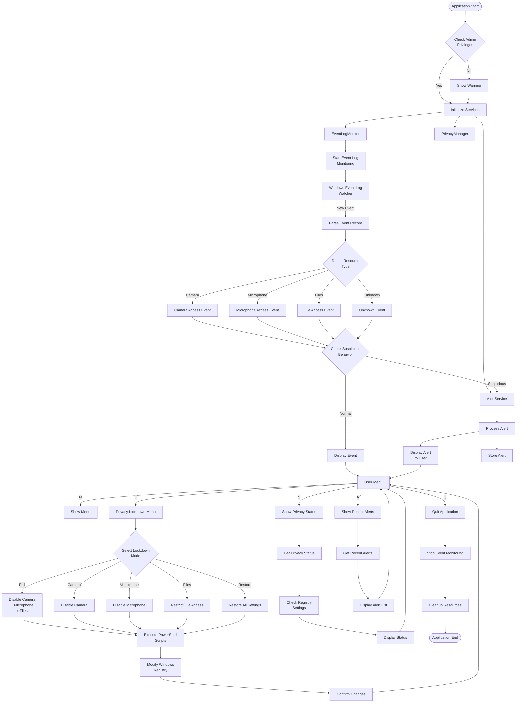
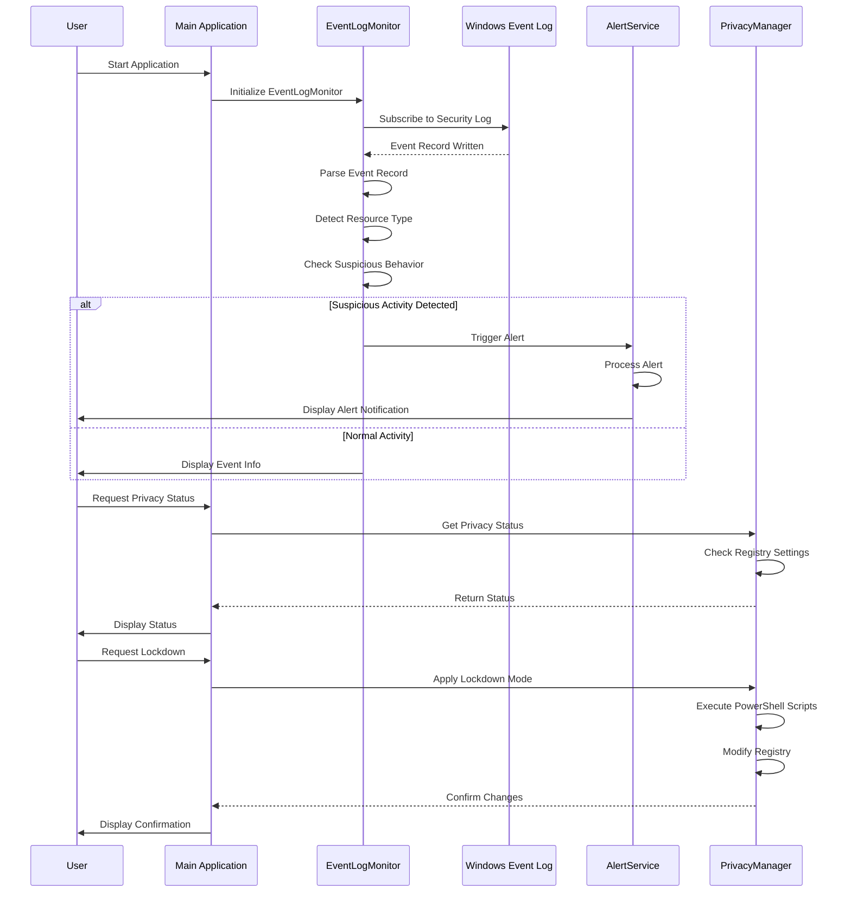
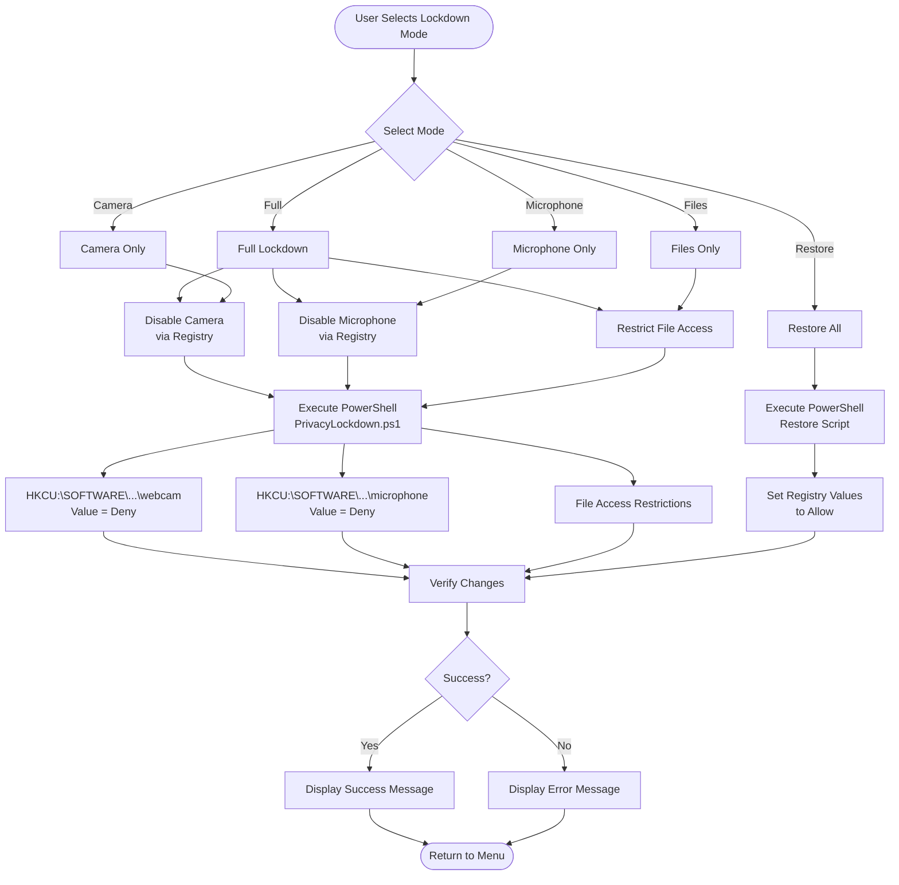
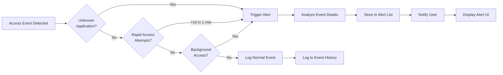
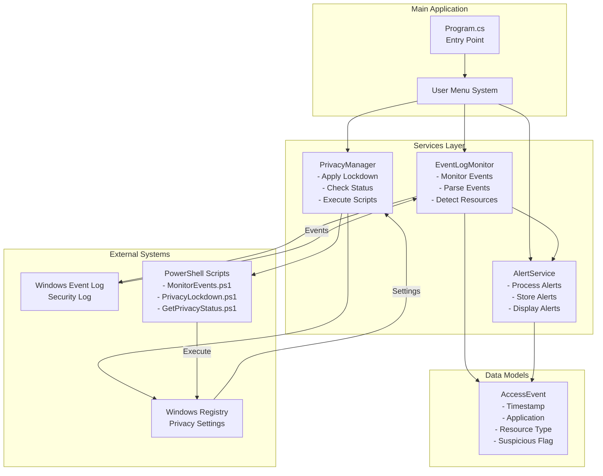
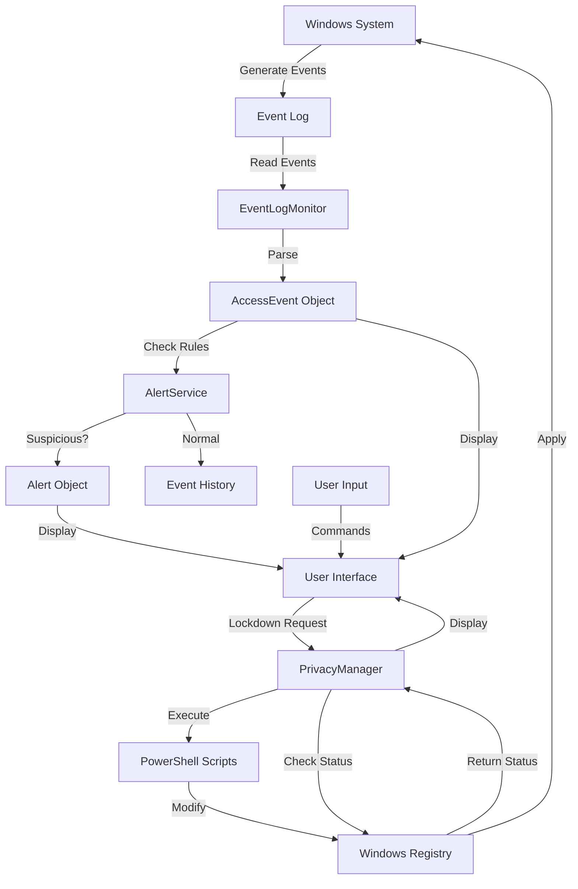

# Windows Privacy Inspector - Workflow Diagram

## System Architecture Flow

## Event Monitoring Flow

## Privacy Lockdown Flow

## Alert Detection Flow

## Component Interaction Diagram

## Data Flow Diagram

